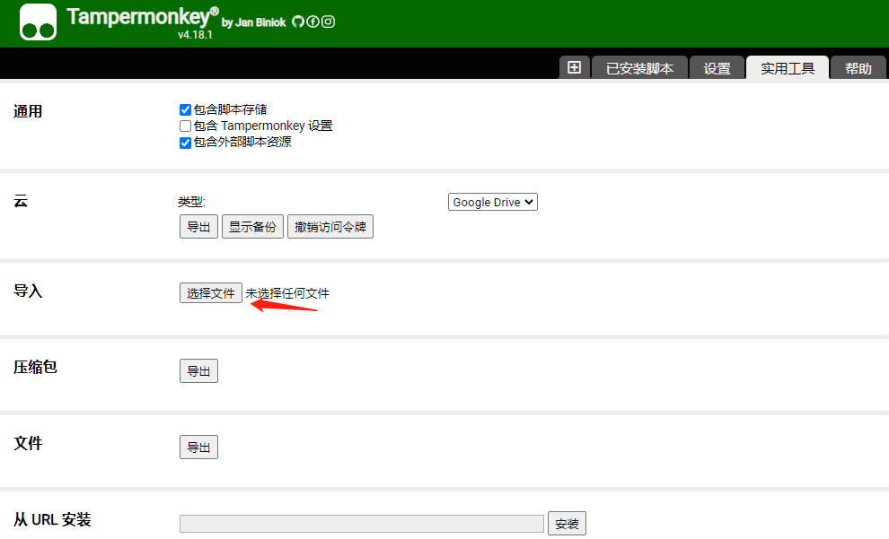

# ChatGPT2Markdown
This project is a tampermonkey script which can convert chatgpt sessions to markdown language

1. Install tamplermonkey from chrome app store

2. Import the script "ChatGPT conversation to markdown.user.js"

3, Refresh chatgpt website, you will see a button on the top right corner. Click the button will convert the current dialog to markdown language and copy it to the clipboard.

Here is an [example](https://github.com/crazyyao0/ChatGPT2Markdown/blob/main/examples/examples1.md)
